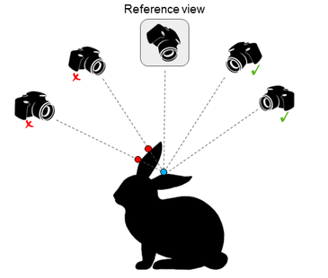

# Learning Unsupervised Multi-View Stereopsis via Robust Photometric Consistency

This repository contains the official implementation of *[Learning Unsupervised Multi-View Stereopsis via Robust Photometric Consistency](https://arxiv.org/abs/1905.02706)* presented as an **oral** at the [3D Scene Understanding for Vision, Graphics, and Robotics workshop](https://scene-understanding.com/2019/program.html), CVPR 2019.

[Project Page](https://tejaskhot.github.io/unsup_mvs/) | [Slides](https://docs.google.com/presentation/d/1dO9WVxGcmMb_kQTiVeKY5hnsptsOSwANYIAH8iYK93g/edit?usp=sharing) | [Poster](resources/poster.pdf)


*Our model consumes a collection of calibrated images of a scene from multiple views and produces depth maps
for every such view. We show that this depth prediction model can be trained in an unsupervised manner using our robust
photo consistency loss. The predicted depth maps are then fused together into a consistent 3D reconstruction which closely
resembles and often improves upon the sensor scanned model. Left to Right: Input images, predicted depth maps, our fused
3D reconstruction, ground truth 3D scan.*


## Abstract
We present a learning based approach for multi-view stereopsis (MVS). While current deep MVS methods achieve impressive results, they crucially rely on ground-truth 3D training data, and acquisition of such precise 3D geometry for supervision is a major hurdle. Our framework instead leverages photometric consistency between multiple views as supervisory signal for learning depth prediction in a wide baseline MVS setup. However, naively applying photo consistency constraints is undesirable due to occlusion and lighting changes across views. To overcome this, we propose a robust loss formulation that: a) enforces first order consistency and b) for each point, selectively enforces consistency with some views, thus implicitly handling occlusions. We demonstrate our ability to learn MVS without 3D supervision using a real dataset, and show that each component of our proposed robust loss results in a significant improvement. We qualitatively observe that our reconstructions are often more complete than the acquired ground truth, further showing the merits of this approach. Lastly, our learned model generalizes to novel settings, and our approach allows adaptation of existing CNNs to datasets without ground-truth 3D by unsupervised finetuning.

## Summary

### Intuition
For a set of images of a scene, a given point in a
source image may not be visible across all other views.



### Implementation
The predicted depth map from the
network, along with the reference image are used to warp
and calculate a loss map for each of M non-reference neighboring views. These M loss maps are then concatenated into a volume of dimension H × W × M,
where H and W are the image dimensions. This volume is
used to perform a pixel-wise selection to pick the K “best”
(lowest loss) values, along the 3rd dimension of the volume
(i.e. over the M loss maps), using which we take the mean
to compute our robust photometric loss.


## Results
Pre-trained model weights and outputs (depth maps, point clouds, 3D ply files) for the DTU dataset can be downloaded from [Google Drive](https://drive.google.com/drive/folders/1uVQ0rkjaZemLU76nDZi8DAI8JM48Xmw4?usp=sharing).


## Installation

To check out the source code:

```
git clone https://github.com/tejaskhot/unsup_mvs/
``` 

Install CUDA 9.0, CUDNN 7.0 and Python 2.7. Please note that this code has not been tested with other versions and may likely need changes for running with different versions of libraries. This code is also not optimized for multi-GPU execution.

Recommended conda environment:

```
conda create -n mvs python=2.7 pip
conda activate mvs
pip install -r requirements.txt
```

Parts of the code for this project are borrowed and modified from the excellent [MVSNet](https://github.com/YoYo000/MVSNet) repository. Please follow instructions detailed there for downloading and processing data, and for installing [fusibile](https://github.com/kysucix/fusibile) which is used for fusion of the depth maps into a point cloud.

## Training
* Download the preprocessed [DTU training data](https://drive.google.com/file/d/1eDjh-_bxKKnEuz5h-HXS7EDJn59clx6V/view).
* Create directories for saving logs, model checkpoints and intermediate outputs.
* Enter the `code/unsup_mvsnet/` folder. 
* Train the model on DTU by using appropriate paths as defined by the flags.
```
python train_dtu.py --dtu_data_root <YOUR_PATH> --log_dir <YOUR_PATH> --save_dir <YOUR_PATH> --save_op_dir <YOUR_PATH>
```
> Note: 
> * Specify `dtu_data_root` to be the folder where you downloaded the training data. If the data was downloaded to `MVS` folder, then the path here will be `MVS/mvs_training/dtu/`.
> * Specify `log_dir`, `save_dir` and `save_op_dir` to the corresponding directories that you created above for saving logs, model checkpoints and intermediate outputs.
> * For training the model with higher depth resolution, note that you have to change both `max_d` and `interval_scale` values inversely i.e. `2 * max_d` --> `0.5 * interval_scale`

## Testing
* Download the preprocessed [DTU testing data](https://drive.google.com/file/d/135oKPefcPTsdtLRzoDAQtPpHuoIrpRI_/view).
* Enter the `code/unsup_mvsnet/` folder. 
* In order to generate the depth predictions from the model, run the test script with appropriate paths.
```
python test_dtu.py --dense_folder <YOUR_PATH> --output_folder <YOUR_PATH> --model_dir <YOUR_PATH> --ckpt_step 45000
```
> Note: 
> * Specify `dense_folder` to be the folder where you downloaded the testing data. If the data was downloaded to `MVS` folder, then the path here will be `MVS/mvs_testing/dtu/`.
> * Specify `output_folder` to be the folder where you would like to store the generated depth map outputs.
> * Specify `model_folder` to be the folder where the model checkpoints are stored.
> * You can specify `ckpt_step` for the checkpoint step at which you want to test the model. Default is `45000`.
* Next, install [fusibile](https://github.com/kysucix/fusibile) as follows:
  * Check out the modified version fusibile with `git clone https://github.com/YoYo000/fusibile`
  * Enter the clone repository folder. 
  * Install fusibile by `cmake .` and `make`, which will generate the executable at `FUSIBILE_EXE_PATH` which is same as the clone repository.
  * Next, we have to perform post processing in the form of depth fusion to create the final 3D point cloud. In the same folder, run the depth fusionn script as shown below.
```
python depthfusion_dtu.py --model_folder <YOUR_PATH> --image_folder <YOUR_PATH> --cam_folder <YOUR_PATH> --fusibile_exe_path <YOUR_PATH>
```
> Note:
> * Specify `model_folder` to be the folder where the model checkpoints are stored.
> * Specify `image_folder` and `cam_folder` to be the same path as that for `dense_folder` above.
> * `fusibile_exe_path` is the `FUSIBILE_EXE_PATH`.
> * The final point cloud is stored in `MVS/mvs_testing/dtu/points_mvsnet/consistencyCheck-TIME/final3d_model.ply`.
* The final ply files can be visualized in an application such as [MeshLab](http://www.meshlab.net/).

## Citation
If you find this work useful, please cite the paper. 
```
@article{khot2019learning,
  title={Learning Unsupervised Multi-View Stereopsis via Robust Photometric Consistency},
  author={Khot, Tejas and Agrawal, Shubham and Tulsiani, Shubham and Mertz, Christoph and Lucey, Simon and Hebert, Martial},
  journal={arXiv preprint arXiv:1905.02706},
  year={2019}
}
```

Please consider also citing [MVSNet](https://github.com/YoYo000/MVSNet) if you found the code useful.

